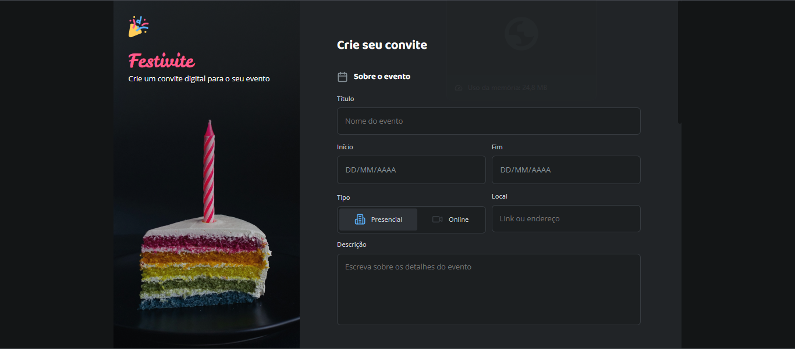

# ✉️ Formulário de Convite - Rocketseat Challenge

Este projeto foi desenvolvido como parte de um desafio proposto no curso **Fullstack da Rocketseat**.  
O objetivo era criar uma página com um formulário funcional e estilizado para envio de convites, aplicando HTML e CSS com foco em estrutura, semântica e layout moderno.

## 📚 Descrição do projeto

O formulário contém:

- Campos para nome e e-mail
- Opção de mensagem personalizada
- Botão de envio estilizado
- Layout centralizado e responsivo

## 💻 Tecnologias utilizadas

- HTML5  
- CSS3  
- Flexbox  
- Pseudo-classes  
- Variáveis CSS  

## 🌐 Acesse o projeto online

🔗 [Clique aqui para ver o site publicado](https://kauasilvandrade.github.io/invitationForm)

## 📸 Imagem do projeto

